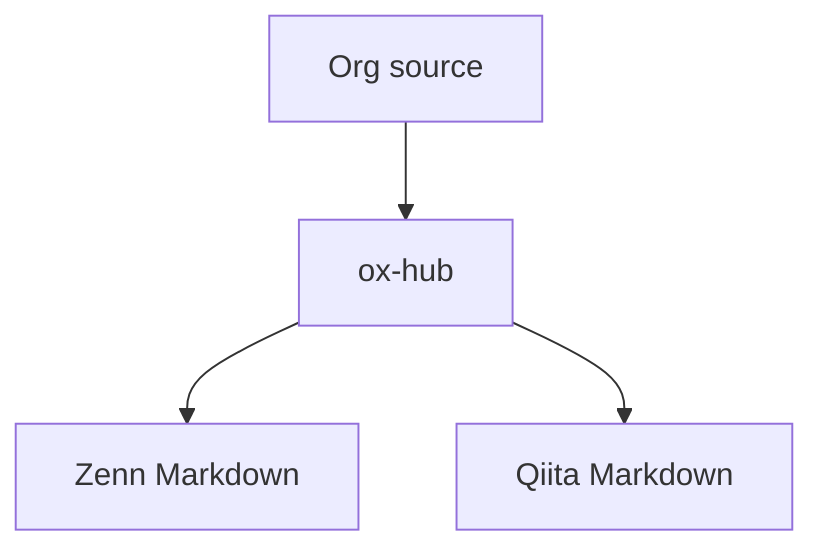

# はじめに

これは ox-hub の変換確認用の記事です。
この段落では **bold**, *italic*, `code`, `verbatim`, ~~strike~~ を確認します。

外部リンクは [Example Domain](https://example.com) として出力されます。
通常の file link は [Notes](notes.org) として、画像 file link は  として出力されます。

## リスト

- unordered item one
- unordered item two
  - nested unordered child
  - nested unordered child two
- multi paragraph item

    second paragraph in the same list item

1. ordered item one
2. ordered item two
   1. nested ordered child
   2. nested ordered child two
3. ordered multi paragraph item

      second paragraph in the same ordered item

## 引用

> 引用ブロックです。
> 引用内でも **bold** と `code` を確認します。

## テーブル

| Name | Value | Note |
| --- | --- | --- |
| alpha | 1 | first row |
| beta | 2 | second row |
| gamma | 3 | third row |

## コードブロック

```emacs-lisp
(defun ox-hub-test-message ()
  (message "Hello from ox-hub"))
```

```
This is an example block.
It is rendered as a fenced code block without language.
```

````text
This block contains a Markdown fence:
```
The outer fence should become longer.
````



## 水平線と脚注

水平線の前の段落です。

-----

水平線の後の段落です。脚注参照も確認します[^note1]。

## oxhub directive

> これは info message です。

> **Warning:**
>
> これは alert message です。

<details><summary>詳細 &lt;summary&gt; &amp; escape</summary>

details directive の本文です。
Qiita では summary が HTML escape されることを確認します。

</details>

```emacs-lisp:init.el
(setq inhibit-startup-screen t)
(message "codefile directive")
```

# おわりに

ここまでが対応済み記法の変換確認です。

[^note1]: これは脚注定義です。
